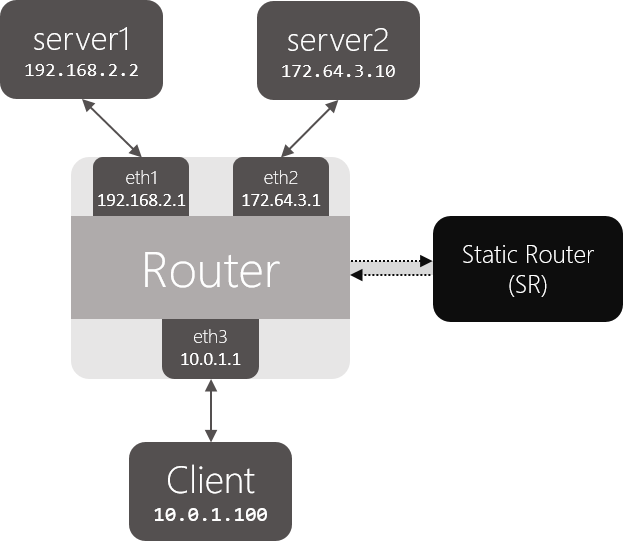

# Lab 3: Simple Static Router

- Due **Wednesday, November 9, noon**
- Please refer to the [course administrative handout](https://suclass.stanford.edu/c4x/Engineering/CS144/asset/admin.pdf) for the late policy

### Links
- [Virtual machine image](http://web.stanford.edu/class/cs144/assignments/cs144-vm.ova) - **Note: you can reuse the VM from labs 1 and 2**
- [Detailed VM setup instructions](http://web.stanford.edu/class/cs144/assignments/vm/vm-setup.html) - **READ the new section on Mininet test!**
- [Slides](https://docs.google.com/presentation/d/1ZoWVZWCH4eEQynHr4pc2R4e5rLGwcwe3iQwDWNH31MQ/edit?usp=sharing) - **REVIEW THESE SLIDES, especially GETTING STARTED!**
- [Submission website](https://web.stanford.edu/class/cs144/cgi-bin/submit/index.php)

## 0. Collaboration Policy

You should direct most questions to Piazza, but <u>_**do not**_</u> post any source code there. Please make a private post when appropriate.

You must write all the code you hand in for the programming assignments, except for the code that we give you as part of the assignment and system library code. You are **not allowed** to show your code to anyone else in the class or look at anyone else's code. You also must not look at solutions from previous years. You may discuss the assignments with other students, but do not copy each others' code. Please refer to the course administrative handout for more details, and ask questions in Piazza if anything is unclear.

## 1. Introduction

In this lab assignment you will be writing a simple router configured with a static routing table. Your router will receive raw Ethernet frames. It will process the packets just like a real router, then forward them to the correct outgoing interface.

Your task is to implement the forwarding logic so packets go to the correct interface.

This is not a simulation: your router will route real packets to HTTP servers sitting behind your router. When you have finished your router, you should be able to access these servers using regular client software (e.g., `wget`/`curl`). In addition, you should be able to `ping` and `traceroute` to and through a functioning Internet router. This is the topology you will be using for your development:

_Figure: The topology for Lab 3 consisting of the router with three interfaces connecting two HTTP servers to the VM._

You will use a software package called Mininet, developed at Stanford, to set up these topologies of emulated routers and and process packets in them. Once your router is functioning correctly, you will be able to perform all of the following operations:

- Ping any of the router's interfaces from the servers and from the VM.
- Traceroute to any of the router's interface IP addresses.
- Ping any of the HTTP servers from the VM (or from the other server).
- Traceroute to any of the HTTP server IP addresses.
- Download a file using HTTP from one of the HTTP servers.

Additional requirements are laid out in the "Requirements" section.

## 2. Don't be Discouraged!

At a high level, this assignment might seem not too hard; your code just has to handle ARP and forward IP packets. But the devil is in the details. There are many little things which your code has to get perfectly right or other routers and computers will reject your packets. A correct implementation can involve adding less than 500 lines of code, but those lines of code have to be almost perfect for it to all come together. And when it does, poof! -- you'll suddenly have a working Internet router, which is a huge accomplishment.

So don't be discouraged if nothing seems to work and you can't figure out why. Instead, talk with your fellow students and staff on Piazza, who can help out. Use Wireshark to compare the packets your router generates with those the reference generates, and pick though every last field to see what's different. If you're having a problem or bug, chances are someone else has had the exact same one, and they can help you, or you can help each other.

Completing this assignment will teach you the style and care in coding that low-level systems need. It's a fantastically useful skill, in that once you have this discipline and care, programming becomes much easier because you write far fewer bugs. After completing this assignment, several of the key pieces of the Internet -- longest prefix match, ARP, and IP itself -- will be second nature to you, and you'll know them inside and out.

## 3. Get Started

### Virtual Machine

Your assignment will run in a local virtual machine. To get started with the VM, please refer to the [VM setup guide](http://web.stanford.edu/class/cs144/assignments/vm-setup.html).

### Starter Code

To obtain the starter code, clone the repo into your VM:

    git clone https://bitbucket.org/cs144-1617/lab3.git

The starter code can be found in `path_to_lab3/router/`

Your router table can be found in the `rtable` file in the same directory.

## Understanding a Routing Table File

Each line in the routing table (rtable) file is a routing entry and has the following format:

    prefix        next_hop     netmask          interface

Here is the default routing table that you will find on the VM. The first entry is the default route.

    0.0.0.0       10.0.1.100   0.0.0.0          eth3
    192.168.2.2   192.168.2.2  255.255.255.255  eth1
    172.64.3.10   172.64.3.10  255.255.255.255  eth2

### Building and Running

You should now have all the pieces needed to build and run the router:

- A routing table file that corresponds to the routing table for the router node in that topology
- The starter code

You can build and run the starter code as follows:

    make
    ./sr

Mininet and POX need to be started for SR to run. From the `path_to_lab3` directory, you need to run:

	sudo ./run_all.sh

To shutdown Mininet,

	sudo ./killall.sh

## 4. Background: Routing

This section has an outline of the forwarding logic for a router, although it does not contain all the details. There are two main parts to this assignment: IP forwarding, and handling ARP.

When an IP packet arrives at your router, it arrives inside an Ethernet frame. Your router needs to check if it is the final destination of the packet, and if not, forward it along the correct link based on its forwarding table. The forwarding table names the IP address of the next hop. The router must use ARP to learn the Ethernet address of the next hop IP address, so it can address the Ethernet frame correctly.

### IP Forwarding and ARPs

Given a raw Ethernet frame, if the frame contains an IP packet whose destination is not one of the router's interfaces:

1. Check that the packet is valid (is large enough to hold an IP header and has a correct checksum).
2. Decrement the TTL by `1`, and recompute the packet checksum over the modified header.
3. Find out which entry in the routing table has the longest prefix match with the destination IP address.
4. Check the ARP cache for the next-hop MAC address corresponding to the next-hop IP. If it's there, send it. Otherwise, send an ARP request for the next-hop IP (if one hasn't been sent within the last second), and add the packet to the queue of packets waiting on this ARP request.

This is a high-level overview of the forwarding process. More low-level details are below. For example, if an error occurs in any of the above steps, you will have to send an ICMP message back to the sender notifying them of an error. You may also get an ARP request or reply, which has to interact with the ARP cache correctly.

### Protocols to Understand

**Ethernet**

You are given a raw Ethernet frame and have to send raw Ethernet frames. You should understand source and destination MAC addresses and the idea that we forward a packet one hop by changing the destination MAC address of the forwarded packet to the MAC address of the next hop's incoming interface.

**Internet Protocol**

Before operating on an IP packet, you should verify its checksum and make sure it is large enough to hold an IP packet. You should understand how to find the longest prefix match of a destination IP address in the routing table described in the "Getting Started" section. If you determine that a datagram should be forwarded, you should correctly decrement the TTL field of the header and recompute the checksum over the changed header before forwarding it to the next hop.

**Internet Control Message Protocol**

ICMP sends control information. In this assignment, your router will use ICMP to send messages back to a sending host. You will need to properly generate the following ICMP messages (including the ICMP header checksum) in response to the sending host under the following conditions:

- **Echo reply (type 0)** 
Sent in response to an echo request (`ping`) to one of the router's interfaces. (This is only for echo requests to any of the router's IPs. An echo request sent elsewhere should be forwarded).
- **Destination net unreachable (type 3, code 0)** 
Sent if there is a non-existent route to the destination IP (no matching entry in routing table when forwarding an IP packet).
- **Destination host unreachable (type 3, code 1)**
Sent after **five** ARP requests were sent to the next-hop IP without a response.
- **Port unreachable (type 3, code 3)**
Sent if an IP packet containing a UDP or TCP payload is sent to one of the router's interfaces. This is needed for `traceroute` to work.
- **Time exceeded (type 11, code 0)**
Sent if an IP packet is discarded during processing because the TTL field is `0`. This is also needed for `traceroute` to work.

Some ICMP messages may come from the source address of any of the router interfaces, while others must come from a specific interface: refer to [RFC 792](http://tools.ietf.org/html/rfc792) for details. As mentioned above, the only incoming ICMP message destined towards the router's IPs that you have to explicitly process are ICMP echo requests. You may want to create additional structs for ICMP messages for convenience, but make sure to use the `packed` attribute so that the compiler doesn't try to align the fields in the struct to word boundaries: [GCC Type Attributes](http://gcc.gnu.org/onlinedocs/gcc-3.2/gcc/Type-Attributes.html).

**Address Resolution Protocol**

ARP is needed to determine the next-hop MAC address that corresponds to the next-hop IP address stored in the routing table. Without the ability to generate an ARP request and process ARP replies, your router would not be able to fill out the destination MAC address field of the raw Ethernet frame you are sending over the outgoing interface. Analogously, without the ability to process ARP requests and generate ARP replies, no other router could send your router Ethernet frames. Therefore, your router must generate and process ARP requests and replies.

To lessen the number of ARP requests sent out, you are required to cache ARP replies. Cache entries should time out after `15` seconds to minimize staleness. The provided ARP cache class already times the entries out for you.

When forwarding a packet to a next-hop IP address, the router should first check the ARP cache for the corresponding MAC address before sending an ARP request. In the case of a cache miss, an ARP request should be sent to a target IP address about once every second until a reply comes in. If the ARP request is sent **five** times with no reply, an ICMP destination host unreachable is sent back to the source IP as stated above. The provided ARP request queue will help you manage the request queue.

In the case of an ARP request, you should only send an ARP reply if the target IP address is one of your router's IP addresses. In the case of an ARP reply, you should only cache the entry if the target IP address is one of your router's IP addresses.

Note that ARP requests are sent to the broadcast MAC address (`ff-ff-ff-ff-ff-ff`). ARP replies are sent directly to the requester's MAC address.

**IP Packet Destinations**

An incoming IP packet may be destined for one of your router's IP addresses, or it may be destined elsewhere. If it is sent to one of your router's IP addresses, you should take the following actions, consistent with the section on protocols above:

- If the packet is an ICMP echo request and its checksum is valid, send an ICMP echo reply to the sending host.
- If the packet contains a TCP or UDP payload, send an ICMP port unreachable to the sending host.
- Otherwise, ignore the packet.

Packets destined elsewhere should be forwarded using your normal forwarding logic.

## 5. Code Overview

### Basic Functions

Your router receives and sends Ethernet frames. The basic functions to handle these functions are:

- `sr_handlepacket(struct sr_instance* sr, uint8_t *packet, unsigned int len, char* interface)` 
This method, located in `sr_router.c`, is called by the router each time a packet is received. The `packet` argument points to the packet buffer which contains the full packet including the Ethernet header. The name of the receiving `interface` is passed into the method as well. 

- `sr_send_packet(struct sr_instance* sr, uint8_t* buf, unsigned int len, const char* iface)` 
This method, located in `sr_vns_comm.c`, will send `len` bytes of `buf` out of the interface specified by `iface`. The `buf` parameter should point to a valid Ethernet frame, and `len` should not go past the end of the frame.  
You should not free the buffer given to you in `sr_handlepacket()` (this is why the buffer is labeled as being "lent" to you in the comments). You are responsible for doing correct memory management on the buffers that `sr_send_packet` borrows from you (that is, `sr_send_packet` will not call `free()` on the buffers that you pass it). 

- `sr_arpcache_sweepreqs(struct sr_instance *sr)` 
The assignment requires you to send an ARP request about once a second until a reply comes back or you have sent five requests. This function is defined in `sr_arpcache.c` and called every second, and you should add code that iterates through the ARP request queue and re-sends any outstanding ARP requests that haven't been sent in the past second. If an ARP request has been sent 5 times with no response, a destination host unreachable should go back to all the sender of packets that were waiting on a reply to this ARP request.

### Data Structures

**The Router (`sr_router.h`)**

The full context of the router is housed in the struct `sr_instance` (`sr_router.h`). `sr_instance` contains information about topology the router is routing for as well as the routing table and the list of interfaces.

**Interfaces (`sr_if.c/h`)**

After connecting, the server will send the client the hardware information for that host. The stub code uses this to create a linked list of interfaces in the router instance at member `if_list`. Utility methods for handling the interface list can be found at `sr_if.c/h`.

**The Routing Table (`sr_rt.c/h`)**

The routing table in the stub code is read on from a file (default filename `rtable`, can be set with command line option `-r`) and stored in a linked list of routing entries in the current routing instance (the member name is `routing_table`).

**The ARP Cache and ARP Request Queue (`sr_arpcache.c/h`)**

You will need to add ARP requests and packets waiting on responses to those ARP requests to the ARP request queue. When an ARP response arrives, you will have to remove the ARP request from the queue and place it onto the ARP cache, forwarding any packets that were waiting on that ARP request. Pseudocode for these operations is provided in `sr_arpcache.h`. The base code already creates a thread that times out ARP cache entries 15 seconds after they are added for you. You must fill out the `sr_arpcache_sweepreqs()` function in `sr_arpcache.c` that gets called every second to iterate through the ARP request queue and re-send ARP requests if necessary. Psuedocode for this is provided in `sr_arpcache.h`.

**Protocol Headers (`sr_protocol.h`)**

Within the router framework you will be dealing directly with raw Ethernet packets. The stub code itself provides some data structures in `sr_protocols.h` which you may use to manipulate headers easily. There are a number of resources which describe the protocol headers in detail. Network Sorcery's RFC Sourcebook provides a condensed reference to the packet formats you'll be dealing with:

- [Ethernet](http://www.networksorcery.com/enp/protocol/ethernet.htm)
- [IP](http://www.networksorcery.com/enp/protocol/ip.htm)
- [ICMP](http://www.networksorcery.com/enp/protocol/icmp.htm)
- [ARP](http://www.networksorcery.com/enp/protocol/arp.htm)

For the actual specifications, there are also the RFCs for ARP [RFC826](http://www.stanford.edu/class/cs244a/rfc/rfc826.txt), IP [RFC791](http://www.stanford.edu/class/cs244a/rfc/rfc791.txt), and ICMP [RFC792](http://www.stanford.edu/class/cs244a/rfc/rfc792.txt).

## 6. Requirements

In summary, your solution:

1. MUST correctly generate ARP request packets following [RFC826](http://www.stanford.edu/class/cs244a/rfc/rfc826.txt).
2. MUST correctly respond to ARP request packets following [RFC826](http://www.stanford.edu/class/cs244a/rfc/rfc826.txt).
    - It MUST only respond if appropriate.
    - It MUST respond from the proper interface.
    - Responses MUST be unicast.
3. MUST correctly handle ARP response packets by populating the ARP cache.
4. MAY populate the ARP cache with overheard requests.
5. MUST generate the correct ICMP messages for these cases:
    - Receive an ICMP echo request.
    - A received packet's destination has no forwarding table entry.
    - The router cannot determine the link layer address of a packet's next hop. "cannot determine" means there is no ARP entry and 5 consecutive ARP requests fail.
    - A UDP or TCP packet is sent to one of the router's interfaces. This MUST generate an ICMP port unreachable message.
    - A packet's TTL, after being decremented, is `0`.
6. The router MUST correctly route packets using IPv4 between the Internet and the application servers.
    - It MUST check received packets: check the length fields are valid and correct, the IP version is `4`, and any other checks you think are needed.
    - It MAY assume no IP options are used.
    - It MUST correctly validate and generate checksums.
    - It MUST decrement the TTL.
    - It MUST forward packets using the forwarding table, selecting an entry with the longest prefix match algorithm.
    - Note that an Ethernet frame payload may be larger than the encapsulated IP packet. That is, there may be some padding bytes after the IP packet. This can occur when an Ethernet interface tries to align frames on 4-byte boundaries.
7. MUST correctly handle `traceroute`s through it (where it is not the end host) and to it (where it is the end host).
8. MUST maintain an ARP cache whose entries are invalidated after a timeout period (timeouts should be on the order of 15 seconds).
9. MUST NOT drop a packet unless there is no matching forwarding table entry, the router cannot determine the next hop link address, or cannot parse the packet.
10. MUST queue all packets waiting for outstanding ARP replies.
11. SHOULD drop a packet waiting for an ARP reply after 5 failed requests for a reply since receiving the packet.

## 7. How to Debug

Debugging is a critical skill in programming and systems programming specifically. Because your error might be due to some tiny, low-level mistake, trying to read through pages and pages of `printf()` output is a waste of time. While `printf()` is of course useful, you will be able to debug your code much faster if you also log packets and use `gdb`.

If you are unfamiliar with `gdb`, former CS 144 student Sam King has videos online: [part1](http://openclassroom.stanford.edu/MainFolder/VideoPage.php?course=PracticalUnix&video=gdb-essentials-1&speed=100) [part2](http://openclassroom.stanford.edu/MainFolder/VideoPage.php?course=PracticalUnix&video=gdb-essentials-2&speed=100). This is part of his free [Practical Unix](http://openclassroom.stanford.edu/MainFolder/CoursePage.php?course=PracticalUnix) course that may be useful to anyone who is not comfortable with our Linux environment.

### Protocols: Logging Packets

You can log the packets received and generated by your SR program by using the `-l` parameter. The file will be in `pcap` format, so you can use Wireshark or `tcpdump` to read it.

    ./sr -l logfile.pcap

Besides SR, you can also use Mininet to monitor the traffic that goes in and out of the emulated nodes, i.e., `router`, `server1` and `server2`. Mininet provides direct access to each emulated node. Using `server1` as an example, to see the packets in and out of it, go to the Mininet CLI:

    mininet> server1 sudo tcpdump -n -i server1-eth0

Or you can bring up a terminal inside `server1` by

    mininet> xterm server1

Then inside the newly popped xterm,

    xterm# sudo tcpdump -n -i server1-eth0

### Router

**Using GDB**

We encourage you to use `gdb` to debug any router crashes, and `valgrind` to check for memory leaks. These tools should make debugging your code easier and using them is a valuable skill to have going forward.

**Debugging Functions**

We have provided you with some basic debugging functions in `sr_utils.h`, `sr_utils.c`. Feel free to use them to print out network header information from your packets. Below are some functions you may find useful:

- `print_hdrs(uint8_t *buf, uint32_t length)` 
Prints out all possible headers starting from the Ethernet header in the packet.
- `print_addr_ip_int(uint32_t ip)` 
Prints out a formatted IP address from a `uint32_t`. Make sure you are passing the IP address in the correct byte ordering.

## 8. Testing

Designing and writing tests to match specfications is an important part of network programming. For this lab, you should be thinking carefully what the spec requirements entail and how to properly test that your implementation fulfills them. Combining test cases for the internals of your implementation and test scripts that ensure your router meets the requirements may be a good strategy. Such tests will not only give you a good sense of how accurate your implementation is, but can significantly speed up programming time, as both bugs and misconceptions can be caught early.

Scripting languages like Python provide rich network programming libraries that can ease the implementation of comprehensive test cases. In addition, shell scripts can easily leverage a number of unix tools (like `ping`, `wget`, `nc`, `telnet`).

We also have an [online tester](https://web.stanford.edu/class/cs144/cgi-bin/submit/index.php) for you to utilize while testing your system. **Make sure to remove all print statements before submitting!**

## 9. Submitting

### README

You will attach a `README` file to your submission. This file should be 2-3 page document (a page being 30-40 lines) with no more than 80 characters per column to make it easier to read. This file should be included with your submission. It should contain the following sections:

- **Program Structure and Design** - Describe the high-level structure of your code, by insisting on what you actually added to the code. You do not need to discuss in detail the structures that you inherited from the starter code. This should be the longest and most important part of the `README`. Use this as an opportunity to highlight important design aspects (data structures, algorithms, networking principles) and provide greater detail on those areas for your grading TA to understand. You are strongly encouraged to make this `README` as readable as possible by using subheadings and outlines. Do **NOT** simply translate your program into an paragraph of English.
- **Implementation Challenges** - Describe the parts of code that you found most troublesome and explain why. Reflect on how you overcame those challenges and what helped you finally understand the concept that was giving you trouble.
- **Testing** - Describe the tests you performed on your code to evaluate functionality and robustness. Enumerate possible edge cases and explain how you tested for them. Additionally, talk about general testing strategies you used to test systems code.
- **Remaining Bugs** - Point out and explain as best you can any bugs that remain in the code.

### Submission

To package up your code, run:

	make submit

This should create a file called `router-submit.tar.gz`. Submit `router-submit.tar.gz` to the [submission site](https://web.stanford.edu/class/cs144/cgi-bin/submit/index.php). If you do not have a `README` file, this will cause an error.

Once you have submitted your work, your code would be automatically graded by the system. Only those submissions that have been succesfully graded by the system will be considered as valid submissions. We will only consider your **latest** valid submission for your final grade for this lab.

This year we have introduced assignment snapshotting in order to study student progress on the labs. For snapshotting to work, your `lab3` directory should be located in `cs144`'s home. Participation is optional and you will be prompted at submission time. For more information, contact Lisa Yan.

## 10. FAQ

- **How long is this assignment?** 
In our reference solution, we added 520 lines of C, including whitespace and comments. Of course, your solution may need fewer or more lines of code, but this gives you an idea a rough idea of the size of the assignment to a first approximation.
- **What is Mininet?** 
This assignment runs on top of Mininet which was built at Stanford. Mininet allows you to emulate a network with real software on a single machine. You don't have to know how Mininet works to complete this assignment, but if you are curious to know more, visit the [Mininet website](http://www.mininet.org/).
- **Can I have a reference implementation?**
To help you debug your topologies and understand the required behavior we provide a reference binary and you can find it at `path_to_lab3/sr_solution`.
