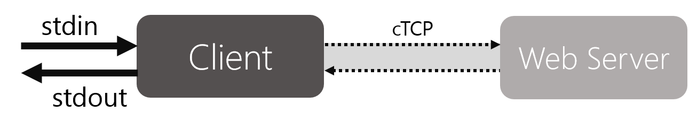

# Labs 1 and 2: Cardinal TCP Client and Server

- Lab 1 due **Friday, October 7, noon** (Hard deadline: October 9 at noon with late penalty)
- Lab 2 due **Wednesday, October 19, noon** (Hard deadline: October 21 at noon with late penalty)
- Please refer to the [course administrative handout](https://suclass.stanford.edu/c4x/Engineering/CS144/asset/admin.pdf) for the late policy

### Links
- [Virtual machine image](http://web.stanford.edu/class/cs144/assignments/cs144-vm.ova)
- [Detailed VM setup instructions](http://web.stanford.edu/class/cs144/assignments/vm/vm-setup.html)
- [Assignment files](https://bitbucket.org/cs144-1617/lab12.git)
- [Submission website](https://web.stanford.edu/class/cs144/cgi-bin/submit/index.php)

## 0. Collaboration Policy

You should direct most questions to Piazza, but <u>_**do not**_</u> post any source code there. Please make a private post when appropriate.

You must write all the code you hand in for the programming assignments, except for the code that we give you as part of the assignment and system library code. You are **not allowed** to show your code to anyone else in the class or look at anyone else's code. You also must not look at solutions from previous years. You may discuss the assignments with other students, but do not copy each others' code. Please refer to the course administrative handout for more details, and ask questions in Piazza if anything is unclear.

## 1. Introduction

This document covers two lab assignments. The second assignment builds on the first. <u>_**Please read through the entire lab assignment before beginning Lab 1**_</u>; there are some parts that are easier to build and make more sense with the whole picture in mind.

### Your Task
Your task is to implement a reliable, stop-and-wait (Lab 1) and sliding window (Lab 2) transport layer on top of the IP layer. This is a minimal, stripped-down version of TCP called **Cardinal TCP (cTCP)**. Cardinal TCP can fully interoperate with regular TCP implementations, but will not have many of the performance improvements and advanced algorithms expected in TCP today (e.g., congestion control). You will implement both the client and server components of cTCP.

### Getting Started
Implementing cTCP requires being able to send IP packets which your code adds a transport (TCP) header to. Doing this in a way that doesn’t confuse the operating system requires some modifications to the OS kernel. You should therefore implement and test Lab 1 and Lab 2 inside a virtual machine that we’re providing. You may write code elsewhere, but it must compile and be tested using the VM provided, as it contains the correct configuration. **Do not upgrade your Ubuntu distribution in the VM, or you will lose this special kernel and cTCP will stop working.**

> Cardinal TCP creates TCP sockets that the operating system is not aware of. When the kernel receives a TCP segment for a cTCP connection, it does not recognize the connection and immediately sends a reset (segment with the `RST` bit set) in response, telling the other side to terminate the connection. The modified kernel does not send resets in response to unrecognized TCP segments and so allows cTCP, running in a Linux process, to manage a TCP connection.

1. Download [Oracle’s VirtualBox](https://www.virtualbox.org/), the program that will let you run the virtual machine.
2. Download the [VM](http://web.stanford.edu/class/cs144/assignments/cs144-vm.ova) (we strongly suggest using a wired connection, or sitting close to an access point). Import the virtual machine into VirtualBox using File->Import Appliance.
3. Start the VM and log in. The user account name is `cs144`, with login `cs144`.
 If you have not used VirtualBox before, you may need to configure some network information. Follow the instructions [here](http://web.stanford.edu/class/cs144/assignments/vm/vm-setup.html).
4. In the terminal, cd to your home directory: `cd ~/`
5. Clone the starter code: `git clone https://bitbucket.org/cs144-1617/lab12.git`
6. Follow the instructions in the `README` for building and running the code.

This year we have introduced assignment snapshotting in order to study student progress on the labs. For snapshotting to work, your `lab12` directory should be located in `cs144`'s home. Participation is optional and you will be prompted at submission time. For more information, contact Lisa Yan.

## 2. Lab 1: Stop and Wait cTCP

The pictures in this section show how your cTCP implementation will work after you complete Lab 1.

The client reads a stream of input data from standard input (STDIN), breaks it up into cTCP segments, and sends the segments to the server. The server reads these segments, ignoring corrupted and duplicate segments, outputting the corresponding data, in order, to STDOUT. Connections are _**bidirectional**_: the server also reads from STDIN and sends segments, and the client also receives segments and outputs data to STDOUT. **BOTH can be sending data segments _at the same time_!**

Each "side", or direction, of the connection can be closed independently. When both sides of the connection are closed, the client and server clean up the associated state (linked lists, structs, anything being used specifically for this connection). This cleanup is often called "tear down", as in "tear down the connection."

Your implementation is TCP-compliant, which means your client can talk to real web servers! In your client, you can type into STDIN and issue an `HTTP GET` request to a web server (`www.google.com:80` for example):

	GET / HTTP/1.1
	Host: www.google.com
	<press enter>

And get a response:

	HTTP/1.1 200 OK
    Date: Sun, 17 May 2015 12:00:00 GMT
    Expires: -1
    …
    </script>
</body></html>

Although cTCP can interoperate with other TCPs, you do not have to implement the TCP state machine; the starter code implements most of this for you. Your implementation only has to handle connection close events (`FIN`).

Not all websites will respond. Ones that are known to work include the following:
- `www.google.com:80`
- `yuba.stanford.edu:80`
- `sing.stanford.edu:80`
- `www.scs.stanford.edu:80`

### Requirements

**Delivery**
- **Reliable delivery.** One side's output should be identical to the other side's input, regardless of a lossy, congested, or corrupting network layer. Ensure reliable transport by having the recipient acknowledge segments received from the sender; the sender detects missing acknowledgements and resends the dropped or corrupted segments. Duplicate segments should not be outputted.
- **Timely delivery.** Your solution should be reasonably fast. For instance, it should not take 2 seconds for every segment sent from the sender to show up at the receiver.
- **Efficient delivery.** Your solution should be reasonably efficient: it should not require gigabytes of memory or send many unnecessary segments. E.g., sending each segment 100 times to protect against losses is not a valid implementation strategy.

**Robustness**
- **Large inputs.** It **MUST** correctly handle inputs much larger than the window size.
- **Binary files.** It **MUST** be able to transfer binary (non-ASCII) files correctly. Be sure to test this!
- **Retransmissions.** cTCP should **retransmit** a segment FIVE times (i.e. send up to a total of SIX times). No more and no less. After that, it should assume that the other side of the connection is not responsive and terminate and tear down the connection.

**cTCP**
- **Connection teardown.** You should handle teardown properly. When you read an `EOF` (`Ctrl + D`) from STDIN, you should send a `FIN` segment to the other side to indicate the end of input. When you receive a `FIN` from the other side, you should acknowledge it, and send an `EOF` to your output by calling `conn_output()` with a `len` of `0`. Once all received segments have been outputted and sent segments acknowledged, you may tear down the connection. Like TCP, a connection is not torn down until both sides have finished transferring data, sent `FIN`s, and have their `FIN`s acknowledged.
    - Note that web servers tend to piggyback `ACK`s on top of `FIN`s, i.e. you will receive segments with both `FIN` + `ACK` flags and should handle these correctly.
    - To be entirely correct, at least one side should wait around for twice the maximum segment lifetime after sending a `FIN` and an `ACK` to a received `FIN` in case that last `ACK` got lost (the way TCP uses the `FIN_WAIT` state), but this is not required.
    - When sending an `ACK` to a `FIN` segment, the `ackno` should be 1 greater than the `seqno` of the `FIN`. i.e. treat the `FIN` segment as a "1-byte" segment with no data.
    - A `FIN` must also be acknowledged (and retransmitted if necessary).
- **Cumulative acknowledgements.** Recall that TCP uses cumulative acknowledgements. The acknowledgement field of a segment contains the first byte that a receiver has not yet received (i.e. the byte it is expecting next). Your implementation must follow these semantics so it can interoperate with other TCP implementations. Your cTCP implementation does not have to handle sequence number overflowing/wrapping around in the lifetime of a connection. Your connections **MUST** always use `1` as the initial sequence number. Remember sequence numbers are incremented in terms of number of **bytes**, not **segments**.
> Real TCP connections start with a randomly generated initial sequence number for each connection (you will learn later this quarter about how not doing so can make a connection vulnerable to some attacks). However, for simplicity, sequence numbers for cTCP start at `1`. The underlying library will do the translation into a randomized sequence number space.
- **Stop-and-wait.** Lab 1 cTCP implements the **stop-and-wait** protocol with a window size of `MAX_SEG_DATA_SIZE` (constant defined in `ctcp.h`). For Lab 1, cTCP needs to support each direction of a connection having only a single segment **with data** in the network at any time. That segment will be at most (`MAX_SEG_DATA_SIZE` + headers) bytes in size. It may send out as many acknowledgements (non-data segments) as it wants, without having to wait.
- **Piggybacked `ACK`s.** Your cTCP needs to be able to receive and output a segment that has _both_ data and `ACK`. However, your implementation does not need to _send_ piggybacked `ACK`s and can output data and `ACK` segments separately.

## 3. Lab 2: Sliding Windows and Network Services

In Lab 2, you will extend cTCP to support multiple client connections to the server, as well as supporting a sliding window of `n * MAX_SEG_DATA_SIZE` (defined in `ctcp.h`), where `n >= 1`. We’ve combined Lab 1 and Lab 2 in a single document because knowing the requirements Lab 2 introduces will affect your Lab 1 design.

In Lab 2, you can initiate several copies of an application on the server side that will output to **STDERR**. A client can communicate with a server-side application by sending messages to the server, which will pipe the messages to STDIN of the application. The STDERR output of the application is piped back to the server, which will transmit the message back to the client. This lets you hook your cTCP up to programs which act as network services.

Some applications you can test on include (but are not limited to) the following:
- `sh`
- `cat`
- `date`
- `grep --line-buffered "your_string_here"`
- `./test` (found in with the starter package)
    - This is a sample C program that takes input from STDIN and outputs to STDERR. You can modify this to make it whatever you want!
    - To compile this program, you have to run `gcc test.c -o test`

### Requirements

Lab 2 must support all the functionality required of Lab 1, but also the following additional functionality:

- **In-order delivery.** Your server and client should ensure that data is written in the correct order, even if the network layer reordered segments. Your receiver should buffer as many bytes as the client may send concurrently.
- **Multiple clients.** Your server should handle multiple client connections. That means it will need to keep state for each client and separate message queues, as well as other supporting structures.
  - For simplicity, the server can have at most 10 clients connecting to it simultaneously.
  - **Note:** Connection teardown will not work properly when multiple clients connect. You will not need to handle this case. However, connection teardown should still work if only a single client connects.
- **Sliding window.** Support window sizes greater than `MAX_SEG_DATA_SIZE`. You should be able to receive multiple segments at once, each of size at most `MAX_SEG_DATA_SIZE` + headers. You should buffer the appropriate number of segments for retransmissions and output.
    - **Note:** A sliding window of size `n * MAX_SEG_DATA_SIZE` may have more than `n` segments, if some segments are smaller than `MAX_SEG_DATA_SIZE`. However, the sum of the data size of these segments is less than or equal to `n * MAX_SEG_DATA_SIZE`.
    - You should account for the situation when two hosts have <i>different</i> window sizes. For example, host A may have a receive window size of `2 * MAX_SEG_DATA_SIZE` and is communicating with host B who has a receive window size of `5 * MAX_SEG_DATA_SIZE`.
    - **Note:** You will not be able to interoperate with web servers with `n > 1` (i.e. a sliding window larger than `MAX_SEG_DATA_SIZE` in size).
- **Application support** - Your implementation must be able to talk to an application (like `sh`) started on a server.
    - **Note:** Connection teardown will not work on the server when an application is running there. You will not be able to type `Ctrl + D`. However, connection teardown must still work for a normal client-to-server connection.

## 4. The Code

One thing to think about before you start is how you will maintain your send and receive windows. There are many reasonable ways to do so, but your decisions here will significantly affect the rest of your code. In Lab 1 cTCP only needs to handle one outstanding segment, but in Lab 2 it will need to handle a send window as well as a receive window. Cumulative acknowledgements mean the send window can be a simple FIFO queue, but lost segments mean the receive window will need to handle when there are holes. Memory management in systems software is extremely important, so think through where and when you will allocate and free any dynamic structures you need.

### Files
Here are all the files that come in the starter code. Feel free to make new helper files as needed, **but if you do, make sure to add them to the `Makefile`**. We encourage you to look at the starter code if you have questions on how it works: it is not very long.

- `ctcp.h` - Header file containing definitions for constants, structs, and functions you will need for the cTCP implementation. **Please read this file carefully because the comments are very useful!**
- **`ctcp.c` - This is the only file you will need to modify. Contains the cTCP implementation.**
- `ctcp_linked_list.h`/`ctcp_linked_list.c` - Basic linked list functions. Optionally use this to keep track of unacknowledged segments, etc.
- `ctcp_sys_internal.h`/`ctcp_sys_internal.c` - Internal library that handles cTCP to TCP translations, etc. You will not need to look at this code at all and will not be using anything from it.
- `ctcp_sys.h` - Definitions for system and connection-related functions like reading input, writing output, sending a segment to a connection, etc. You will be using most of these functions!
- `ctcp_utils.h/ctcp_utils.c` - Helper functions like checksum, current time, etc.
- `test.c` - Sample application that can be used in Lab 2. Feel free to modify this however you want. It will not be used in grading.
- `Makefile` - No need to edit unless you're adding new files.
- `README` - Information on how to build and run cTCP
- `ctcp_README` - You will fill this out. See Section 6's cTCP README.

### Data Structures
**Segments**

You will be sending and receiving cTCP segments (which are like TCP segments with a few fields taken out for simplicity -- the library will transform cTCP segments into actual TCP segments. You can assume no TCP options will be used.). This struct is defined in `ctcp_sys.h`.

    typedef struct ctcp_segment {
        uint32_t seqno;    /* Sequence number (in bytes) */
        uint32_t ackno;    /* Acknowledgement number (in bytes) */
        uint16_t len;      /* Total segment length (including ctcp header) */
        uint32_t flags;    /* Flags */
        uint16_t window;   /* Window size, in bytes */
        uint16_t cksum;    /* Checksum */
        char data[];       /* Start of data */
    } ctcp_segment_t;

Every segment will have a 32-bit sequence number (`seqno`), a 32-bit acknowledgement number (`ackno`), as well as 0 or more bytes of payload (`data`). **All fields (other than `data`) must be in network byte order (meaning you will have to use `htonl()`/`htons()` to write those fields and `ntohl`/`ntohs` to read them).**

- `seqno`: Each segment transmitted must be numbered with a sequence number. The first segment in a stream has a sequence number of `1`. The sequence number indicate **bytes**. That means if you send a segment with 10 bytes of data that has a `seqno` of `10000`, then the next segment you send should have a `seqno` of `10010`.
- `ackno`: Cumulative acknowledgement number. This says that the sender of the segment has received all bytes earlier than `ackno`, and is waiting for a segment with a sequence number of `ackno`. Note that `ackno` is the sequence number you are **waiting** for that you **have not received yet**.
- `len`: Length of the segment. Should include the header and payload data size.
- `flags`: TCP flags. This should be `0` for normal segments, and `ACK` for ack segments (you can set its value by doing `segment->flags |= ack_flag`, where `ack_flag` is the `ACK` flag converted to the right byte-order). To signal the close of a connection, you must use the `FIN` flag. Flags are defined in `ctcp.h`.
- `window`: The TCP window size. Should be an integer multiple of `MAX_SEG_DATA_SIZE` (defined in `ctcp.h`).
- `cksum`: 16-bit cTCP checksum. To set this, you must set the `cksum` field to `0`, then call on the `cksum()` function (defined in `ctcp_utils.h`) over the entire segment. Note that you shouldn't call `htons()` on the checksum value produced by the `cksum()` function -- it is already in network byte order.
- `data`: Payload to the cTCP segment. This should be empty for `FIN`/`ACK`-only segments.

**Connection State**

The `cstate_t` structure (in `ctcp.c`) encapsulates the state of each connection. You should add more fields to this struct as you see fit to keep your per-connection state. Some fields that might be useful to keep include the current sequence number, acknowledgement number, etc. A new `cstate_t` is created by `ctcp_init()`, which is called by the library when there is a new connection.

    struct cstate {
        struct ctcp_state *next;   /* Next in linked list */
        struct ctcp_state **prev;  /* Prev in linked list */

        conn_t *conn;              /* Connection object -- needed in order to
                                      figure out destination when sending */

        /* FIXME: Add other needed fields. */
    };

This `cstate_t` struct is passed into cTCP functions so it can be used to store received segments, etc. There is also a global list of `cstate_t` structs called `state_list` (in `ctcp.c`) that can be used to figure out which segments need resending and which connections to time out.

**Configuration**

The `ctcp_config_t` struct (in `ctcp.h`) contains values to adjust your cTCP implementation.

    typedef struct {
        uint16_t recv_window;  /* Receive window size (a multiple of MAX_SEG_DATA_SIZE) */
        uint16_t send_window;  /* Send window size (receive window size of other host) */
        int timer;             /* How often ctcp_timer is called, in ms */
        int rt_timeout;        /* Retransmission timeout, in ms */
    } ctcp_config_t;

It is passed in when there is a new connection (in `ctcp_init()` in `ctcp.c`). You may want to store this struct or its values in a global variable or within the `ctcp_state_t` struct for later access.

### Functions

**Functions To Implement**

Your task is to implement the following functions in `ctcp.c` (more details about what they should do can be found in `ctcp.h`):

- `ctcp_init()`: Initialize state associated with a connection. This is called by the library when a new connection is made.
- `ctcp_destroy()`: Destroys connection state for a connection. You should call either when 5 retransmission attempts have been made on the same segment OR when all of the following hold:
    - You have received a `FIN` from the other side.
    - You have read an `EOF` or error from your input (`conn_input` returned `-1`) and have sent a `FIN`.
    - All segments you have sent have been acknowledged.
- `ctcp_read()`: This is called if there is input to be read. Create a segment from the input and send it to the connection associated with this input.
- `ctcp_receive()`: This is called when a segment is received. You should send `ACK`s accordingly and output the segment's data to STDOUT.
- `ctcp_output()`: This should output cTCP segments and is called by `ctcp_receive()` if a
segment is ready to be outputted. You should flow control the sender by not acknowledging segments if there is no buffer space for outputting.
- `ctcp_timer()`: Called periodically at specified rate. You can use this timer to inspect segments and retransmit ones that have not been acknowledged. You can also use this to determine if the other end of the connection has died (if they are unresponsive to your retranmissions).

**Helper Functions**

The following functions are needed when implementing the above functions:

- `conn_bufspace()`: Checks how much space is available for output. `conn_output()` can only write as many bytes as reported by `conn_bufspace()`.
- `conn_input()`: Call on this to read input that then needs to be put into segments to send off.
- `conn_send()`: Call on this to send a cTCP segment to a destination associated with a provided connection object.
- `conn_output()`: Call on this to produce output to STDOUT from the segments you have received. You will first have to call on `conn_bufspace()` to see if there is enough space for output.

Linked list helper functions can be found in `ctcp_linked_list.h`. Other helper functions can be found in `ctcp_utils.h`.

## 5. Testing

### Building and Running the Code
More specific details on how to build and run can be found in the `README` included with the starter code. To build the code, simply run `make` in the command-iine.

**Server Mode**

    sudo ./ctcp -s -p [server port]
    sudo ./ctcp -s -p [server port] -w [serer send window multiple] -- [program args]     (Lab 2)

**Client Mode**

    sudo ./ctcp -c [server]:[server port] -p [client port]
    sudo ./ctcp -c [server]:[server port] -p -w [client send window multiple]     (Lab 2)

### Debugging
**Note**: Any debug statements should be printed to STDERR, not STDOUT. This is because STDOUT is being used for the actual program output and it will be confusing for the grader. **Your final solution must not output any debugging information (as it will cause tests to fail).**

To output to STDERR, use the following function:

	fprintf(stderr, "Debug message here", ...);
	fprintf(stderr, "Here's an int: %d", int_number);

We encourage you to use gdb and valgrind. These tools should make debugging your code easier and using them is a valuable skill to have going forward. In addition, a valgrind output will be required in Lab 2.

### Logging
Logging can be enabled with `-l` on one host to view a log of all segments sent and received:

	sudo ./ctcp [arguments] -l

This will create a `.csv` file of the form `[timestamp]-[port]`, where `timestamp` is the timestamp that the host started, and `port` is the port associated with this host. This should have all the header information you need to track segments and to see if the right fields are set.

The `Data` field contains a hex dump of the data sent. You can convert to this to ASCII using any hex-to-ASCII converter.

### Interoperation
Your program must interoperate with the reference implementation, `reference`, included in the assignment package. It must also be able to communicate with web servers (such as `www.google.com`). Some web servers may not respond; however, it must work with google.com.

### Unreliability
Since connections between machines are pretty reliable, we've included tools that will help you simulate an environment with bad network connectivity. They allow you to drop, corrupt, delay, and duplicate segments that you send over the network.

To invoke the tools, run your program with one or more of the following command-line options:

	--drop <drop percentage>
	--corrupt <corrupt percentage>
	--delay <delay percentage>
	--duplicate <duplicate percentage>

The percentage values are integers in the range 0-100 (inclusive), and they determine the probability that an outgoing segment will be affected by the associated action. You can use the following flag to set the random seed value:

	--seed <seed value>

For example, running the following command will drop 5% and corrupt 3% of all outgoing segments:

	./ctcp --drop 5 --corrupt 3 -c localhost:5555 -p 6666

If you also include the `-d` command-line argument, the program will print out more details about the alterations that are being made to your segment.

The tools will alter your segments deterministically. This means that if you run your program twice using the same seed value, the segments will be affected in an identical fashion. This should make it easier for you to reproduce bugs in your code and help you in the debugging process.

Running your program with these flags will only affect outgoing segments. If you would like your incoming segments to be affected as well, you will need to run both instances of cTCP with the command-line flags.

### Large/Binary Inputs
Don't assume that your implementation will always work correctly if you've only tested it by typing messages in the console. Try testing with large files (students have used novels from Project Gutenberg), and test with binary executable files as well (cTCP itself!). You can use input/output redirection to pass large files. MAKE SURE you use these options carefully as they overwrite the contents of the file.

    ctcp-server> sudo ./ctcp [options] > newly_created_test_binary
    ctcp-client> sudo ./ctcp [options] < original_binary

To verify the transfer is correct, use the cmp utility to check the two files match (read the manual by running `man cmp`). To look at their contents in detail, you can use `od -h`.

## 6. Submission

### cTCP README

You will attach a `ctcp_README` file to your submission. This file should be 2-3 page document (a page being 30-40 lines) with no more than 80 characters per column to make it easier to read. This file should be included with your submission. It should contain the following sections:

- **Program Structure and Design** - Describe the high-level structure of your code, by insisting on what you actually added to the code. You do not need to discuss in detail the structures that you inherited from the starter code. This should be the longest and most important part of the `README`. Use this as an opportunity to highlight important design aspects (data structures, algorithms, networking principles) and provide greater detail on those areas for your grading TA to understand. You are strongly encouraged to make this `README` as readable as possible by using subheadings and outlines. Do **NOT** simply translate your program into an paragraph of English.
- **Implementation Challenges** - Describe the parts of code that you found most troublesome and explain why. Reflect on how you overcame those challenges and what helped you finally understand the concept that was giving you trouble.
- **Testing** - Describe the tests you performed on your code to evaluate functionality and robustness. Enumerate possible edge cases and explain how you tested for them. Additionally, talk about general testing strategies you used to test systems code.
- **Remaining Bugs** - Point out and explain as best you can any bugs that remain in the code.
- **Memory Management** - (Lab 2 only) Have valgrind output for both the client and server and explain any memory leaks that valgrind might have discovered.
    - If you receive any valgrind warnings in a file other than `ctcp.c`, then you probably did not free the passed-in `segment` to a cTCP function.
    - valgrind can be invoked by running: `sudo valgrind --leak-check=full --show-leak-kinds=all ./ctcp [params for cTCP]`

You should have a `ctcp_README` for both Labs 1 and 2. Your Lab 2 README should only discuss the things you added for Lab 2 (so don't just copy over your README from Lab 1. If you do this, points will be deducted accordingly).

### Submission
To package up your code, run:

	make submit

This should create a file called `ctcp.tar.gz`. Submit `ctcp.tar.gz` to the [submission site](https://web.stanford.edu/class/cs144/cgi-bin/submit/index.php). If you do not have a `ctcp_README` file, this will cause an error.

## 7. Grading

We will grade your assignment using the provided VM. Your code must compile and run on the VM.

### Tester
We will provide a tester which will run your program against several tests. This is a Python script that must be run in the same directory as the reference binary and your code. It will assume your code compiles into a binary called `ctcp`, which should be the case if the `Makefile` was not modified. These tests are a subset of the ones we will use for grading. They are not comprehensive and you should do your own extensive testing. However, passing all the tests we give you is a good indication of your program's robustness. **MAKE SURE TO REMOVE ALL PRINT STATEMENTS BEFORE RUNNING THE TESTER!**

	sudo python tester-student.py
	sudo python tester-student.py --tests [specific test numbers to run] --timeout [test timeout in secs]
	sudo python tester-student.py --tests 1 2 3

You can increase the test timeout if some tests are failing (as there is still some randomness and test results may differ slightly with each run). However, if your tests only pass consistently with a large timeout (longer than 20s), then there is a problem with your code.

To get a list of all tests:

	sudo python tester-student.py --list

To run all tests for Lab 2:

	sudo python tester-student.py --lab2

### Coding Style
We understand readability can be a subjective measure, and don't want to enforce particular coding expectations; you should ask your style TA who will be style-grading all your assignments. Generally speaking, we expect your code to follow the same style as the library code and to:

- Be readable at the statement and block level, with reasonable naming conventions and consistent formatting/spacing (<=80 characters per line).
- Have comments that shed light on particularly complex pieces of code.
- Have principled, well-considered design and units of functionality. Repeated code, enormous functions, and general lack of structure will make it very hard to understand what you're doing. Your README should describe this structure.

## 8. FAQ

Most questions and answers can be found on Piazza. This is merely a list of logistical questions.

- **Should `ACK`s be piggybacked on top of outgoing data segments?**
 Piggybacking `ACK`s is preferable but not required and you will neither gain nor lose points either way. However, you **do** need to handle **receiving** acks + data from `reference` and webservers.
- **Can we assume that the `len` field in `ctcp_receive()` is correct?**
 No, you must examine the length field of the segment and should not assume the cTCP segment you receive is the correct length. The network might truncate or pad segments.
- **Why is a double pointer `prev` used for the `ctcp_state_t` linked list?**
 This is a clever trick that enables it to delete elements of a linked list efficiently with a bit less pointer rewiring than if `prev` were a single pointer.
- **What sliding window protocol are we supposed to implement for Lab 2?**
 You MUST use selective repeat.
- **Why do all commands have to be run with sudo?**
 cTCP uses raw sockets, which require root in order to open. You can avoid having to type in `sudo` each time if you run the shell as root (`sudo bash`).
- **What's the difference between input/receive and output/send?**
 Input/output is done locally, whereas send/receive is done over a connection.
    - Input is the term we use for text/binary received on a client via STDIN.
    - Receive is when a segment is received from a connection.
    - Output is the text/binary printed out to STDOUT.
    - Send is when a segment is transferred from one client to another.
- **What should I do if an error occurs (e.g. `conn_output()` returns `-1`)?**
 It's up to you. We suggest terminating the connection (via a call to `ctcp_destroy()`).
- **How do you get the `EOF` to show up?**
 The reference solution does this by doing `fprintf(stderr, ...)` when it reads in an `EOF` (`Ctrl + D`) from STDIN. You can add this to your code too.
- **How come when connecting to a webserver, the data I send is `1` byte bigger than what I expect?**
 Webservers expect messages that end with `\r\n`; however, this is difficult to input into the terminal. When communicating with webservers, the library automatically converts all `\n`s to `\r\n`s (hence the `1` extra byte).
- **Will I need to handle overlapping segments?**
 No, you will not need to handle the case when segments overlap (i.e. a new segment has bytes that partially overlap with the bytes of the previous segment).
- **Why am I getting valgrind memory leaks from the starter code (e.g. in `convert_to_ctcp()` or `start_client()`)?**
 Make sure you are freeing all segments passed in from `ctcp_receive()` and freeing the `ctcp_config_t` struct passed into `ctcp_init()`.
